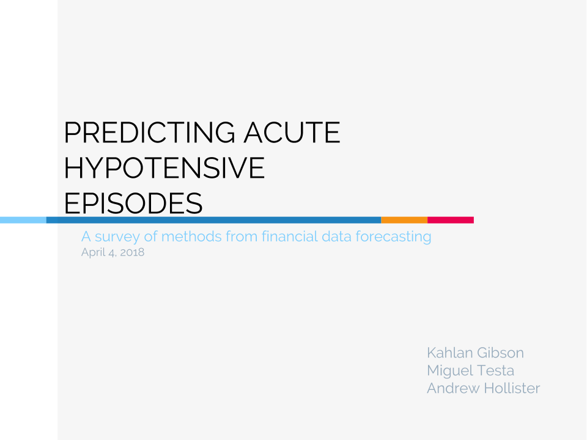

# Predicting Acute Hypotensive Episodes: A Survey of Time-Series Prediction Models Used in Financial Forecasting

[Full paper available here](paper.pdf)

### ABSTRACT

Acute Hypotensive Episodes are critical ICU events that involve a period of critically low arterial blood pressure. These episodes require immediate attention to prevent the incidence of irreversible organ damage or death. Providing prompt courses of treatment appropriate for the episode may help reduce the extent of the damage. Predicting the incidence of an acute hypotensive episode before its onset can enable medical professionals with the ability to immediately begin administering care to their patients. In this paper, we survey a variety of time-series prediction methods commonly used for forecasting financial data and apply these methods to arterial blood pressure recordings to solve the acute hypotensive episode prediction problem. Our approaches achieve a best score of 10/10 for Test Set A and 32/40 for Test Set B of the PhysioNet 2009 Challenge.

### Summary
Acute hypotensive episodes (AHE) are significant periods of time during which a patient's blood pressure drops below a threshold value. AHE can be attributed to a wide variety of possible causes, and identifying the root cause of an AHE reduces the risk of irreversible damage by enabling the administration of the most optimal course of treatment. However, the time-critical nature of AHE in ICU patients often results in medical professionals prescribing a more general intervention in order to buy time for proper diagnosis. In the MIMIC II Database [[1](#bibliogrpahy)], out of the 1237 patients with arterial blood pressure (ABP) recordings, the 511 patients who experienced an AHE have a mortality rate more than twice that of the entire database population. 

Predicting the occurrence of AHE in ICU patients reduces the probability of the patient sustaining irreversible damage by both providing medical professionals with sufficient time to properly diagnose AHEs, and potentially allowing the episode to be prevented altogether. For these reasons, the PhysioNet 2009 challenge involved the prediction of AHE through analysis of ABP recordings. In this paper, we present a survey of common time-series prediction models often used in predicting financial data and apply them to the AHE prediction problem. We begin by describing our methodology, including the PhysioNet Challenge in detail, and we introduce selected financial forecasting models and our application of them to the challenge criteria. Finally, we compare our results on the test set data compared to previous work, and comment on possible alterations that could improve our results. 
